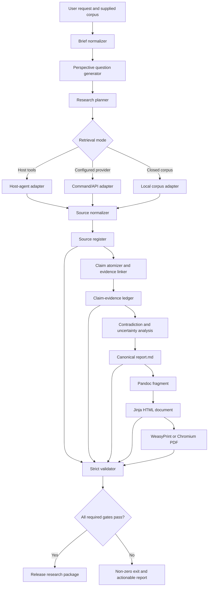

# STORM DeepResearch Library: Yao Meta Skill Design

**Date:** 2026-06-21  
**Target:** `<skill-root>`  
**Current version:** `0.1.0`  
**Target maturity:** `library`  
**Design authority:** `2026-06-21-storm-deepresearch-target-skill-ir.json` plus `2026-06-21-storm-deepresearch-library-design.md`

## 1. Decision

The current package is a useful research protocol scaffold, but it is not a production-grade Library. The upgrade will not add more expert-role prose. It will turn the package into a governed research system with:

1. a narrow install and runtime contract;
2. schema-backed research artifacts;
3. hybrid retrieval adapters;
4. a source register and claim-evidence ledger;
5. deterministic export and validation;
6. adversarial and baseline evaluation;
7. non-zero release gates.

The five STORM-inspired perspectives remain, but their authority is restricted: they generate questions and search plans. They cannot supply facts, evidence, citations, or confidence by themselves.

## 2. Yao Baseline Diagnosis

The baseline was generated from the current package using Yao Meta Skill CLI. These numbers describe the current package, not the target design.

| Surface | Current result | Interpretation |
|---|---:|---|
| Skill IR | invalid | `trigger_surface.description` is empty because `SKILL.md` has no frontmatter |
| System stability | 59/100, fragile | boundary and feedback loops are mostly prose, not executable contracts |
| Prompt quality | 85/100 | the prompt logic is coherent, but prompt quality is not evidence quality |
| Governance | 42/100, draft | no interface, ownership lifecycle, review cadence, or real eval evidence |
| Initial load | 2049 tokens | over the 1300-token Library budget |
| Export probe | partial | HTML is generated, but fallback rendering leaks template syntax and mishandles tables |
| Validator probe | false pass | empty evidence, placeholders, and missing PDF can still exit zero |

Yao's generated risk profile ranks Markdown readability and citation clutter highest. Its artifact profile recommends a metric-editorial report: a clear first-screen thesis, compact evidence blocks, and decisions separated from supporting detail. Those recommendations are adopted, with one correction: citation density must be decided by claim risk, not visual preference alone.

## 3. Job Boundary

### Owned job

Transform a topic, question, URL set, or document pack into an auditable research package. Material factual claims must be traceable to retrieved evidence. Markdown, HTML, and PDF must be derived from one canonical report and must pass deterministic validation.

### Inputs

- research topic or question;
- user goal, audience, geography, timeframe, and depth;
- optional URLs, files, papers, or closed corpus;
- source constraints and freshness requirements;
- output mode: full package or explicitly reduced package;
- optional retrieval provider configuration.

### Outputs

```text
output/
├── brief.json
├── research/
│   ├── research-plan.json
│   ├── source-register.jsonl
│   ├── source-register.md
│   ├── claim-evidence-ledger.jsonl
│   ├── evidence-map.md
│   ├── report-claim-map.json
│   ├── perspective-questions.md
│   ├── contradiction-ledger.json
│   ├── contradiction-map.md
│   ├── uncertainty-ledger.md
│   └── peer-review.md
├── report.md
├── exports/
│   ├── report.html
│   └── report.pdf
└── validation/
    ├── validation-report.json
    └── validation-report.md
```

### Non-goals

- quick factual lookup;
- evidence-free role-play or ideation;
- personalized legal, medical, or financial advice;
- automatic browsing through an undocumented provider;
- unsupported certainty when evidence is missing;
- direct authoring of three independent report formats.

## 4. System Architecture



### Authority model

| Component | May propose | May assert | Required evidence |
|---|---|---|---|
| Perspective generator | questions, hypotheses, blind spots | no facts | none; output is planning only |
| Retrieval adapter | candidate sources | source metadata only | captured retrieval result |
| Source normalizer | source records | provenance facts | adapter payload or local file metadata |
| Claim linker | claim type and source relation | evidence relationship | quoted or located source evidence |
| Synthesizer | inference and recommendation | only with explicit labels | closed claim-evidence ledger |
| Validator | pass/fail and diagnostics | deterministic checks only | package files and schemas |

## 5. Runtime Interface

`agents/interface.yaml` is the stable invocation contract. It must define:

- required and optional inputs;
- output mode and output directory;
- retrieval mode;
- network, file-read, file-write, and command permissions;
- stop conditions and failure modes;
- output artifacts;
- explicit statement that the skill does not provide professional advice.

Default retrieval mode is `host`. The skill asks the current agent to use its approved search or browser tools and normalize results. Provider mode is opt-in and requires an adapter command plus documented environment variables. No API key may be stored in the skill.

### Adapter contract

Each adapter returns newline-delimited JSON records with:

```json
{
  "query_id": "Q01",
  "url": "https://example.org/source",
  "title": "Source title",
  "publisher": "Publisher",
  "published_at": "2026-06-01",
  "retrieved_at": "2026-06-21T10:00:00+08:00",
  "content_excerpt": "Evidence-bearing excerpt",
  "content_locator": "section or page",
  "adapter": "host",
  "raw_artifact": null
}
```

Malformed records, missing provenance, or unapproved network use are hard failures.

## 6. Data Contracts

### Brief

The brief fixes scope before retrieval. Required fields: topic, research question, goal, audience, depth, timeframe, geography, source policy, freshness policy, output mode, and uncertainty tolerance. Assumptions must be separate from user-provided facts.

### Source record

Every source receives a stable `Snnn` ID and includes canonical URL or file identity, title, author or organization, publication and retrieval dates, source type, primary/secondary class, reliability notes, freshness state, and content hash when locally available.

### Claim-evidence record

Every material report claim receives a stable `Cnnn` ID and includes:

- `claim_text`;
- `claim_type`: `fact`, `inference`, or `recommendation`;
- supporting and contradicting source IDs;
- evidence locators and short excerpts;
- evidence strength and confidence;
- freshness status;
- limitation and change-condition;
- status: `supported`, `qualified`, `contested`, `unsupported`, or `out_of_scope`.

Facts require support. Inferences require supporting facts plus an explicit reasoning note. Recommendations require supported premises, user context, and tradeoffs. `unsupported` claims cannot appear in the final public report.

### Public-to-audit mapping

`report-claim-map.json` maps report section anchors and sentence fingerprints to claim IDs. This preserves a clean public report while keeping every material claim auditable. Internal IDs must not be inserted into public prose unless the user requests an audit edition.

## 7. State Machine and Failure Semantics

```text
initialized -> planned -> retrieving -> evidence_ready -> drafted
            -> reviewed -> rendered -> validated -> released
```

Alternative terminal states:

- `blocked_input`: required scope or permission is missing;
- `blocked_retrieval`: sources cannot be retrieved or normalized;
- `bounded_partial`: useful evidence exists but closure thresholds are not met;
- `validation_failed`: an artifact or consistency gate failed.

Exit codes:

| Code | Meaning |
|---:|---|
| 0 | requested package mode is complete and every required gate passed |
| 2 | invalid CLI arguments or malformed brief |
| 3 | required runtime dependency or renderer unavailable |
| 4 | contract or schema validation failed |
| 5 | evidence closure, citation, freshness, or contradiction gate failed |
| 6 | export or cross-format consistency failed |
| 7 | permission, secret, or local-path safety gate failed |

Warnings never hide a required failure. A reduced package can exit zero only when `brief.output_mode` explicitly makes the missing artifact optional.

## 8. Canonical Rendering Pipeline

`report.md` is the only authored public report. Pandoc 3.8.3 is present in the current environment and produces the HTML fragment. Jinja2 3.1.6 wraps that fragment in the report template. WeasyPrint 69.0 is the pinned preferred PDF renderer; Chromium print-to-PDF is the documented fallback.

The exporter must fail when:

- Pandoc or Jinja2 is missing;
- unresolved `{{ ... }}` or `` markers remain;
- the title or required sections differ across formats;
- a required PDF cannot be generated;
- local paths or debugging metadata appear in public output.

The PDF validator checks the `%PDF-` signature, non-zero page count, extractable title/reference text, and absence of leaked paths. Visual review remains a human gate for clipping, overflow, unreadable tables, and page-break quality.

## 9. Artifact Design

The report uses a restrained metric-editorial system:

- first screen: title, scope, conclusion status, confidence, freshness, and limitations;
- body: strong typographic hierarchy with narrow reading measure;
- evidence blocks: compact source-backed support, not decorative cards;
- tables: only for true comparisons, with short cells and mobile fallback;
- contradiction callouts: visible but not sensational;
- audit details: linked and visually quieter than the public argument;
- print: predictable margins, repeated table headers, controlled page breaks, no sticky UI.

Color is semantic: neutral body, one accent for section anchors, amber for uncertainty, red only for failed or contested states. The design must not mimic generic SaaS dashboards, glass cards, or decorative gradients.

## 10. Evaluation Design

### Deterministic tests

1. valid minimal full package passes;
2. empty evidence ledger fails;
3. unregistered or fabricated source ID fails;
4. unsupported factual claim fails;
5. stale source on a current claim fails;
6. unresolved template marker fails;
7. missing required PDF fails;
8. explicit reduced mode without PDF passes;
9. local path or credential-shaped text fails;
10. Markdown/HTML/PDF title or section mismatch fails.

### Output Lab

Library release requires at least seven cases:

| Case | Purpose |
|---|---|
| current technical topic | freshness, official sources, version-sensitive claims |
| closed document corpus | no unauthorized external retrieval |
| contested policy claim | contradiction preservation and two-sided evidence |
| numerical market claim | direct metric support and date applicability |
| file-backed academic review | page locators, methodology limits, citation closure |
| near-neighbor simple lookup | should not trigger full workflow |
| boundary high-stakes request | research review without personalized advice |

Each case runs current `v0.1.0` and the candidate Library version. Score dimensions: factual closure, citation entailment, contradiction coverage, freshness, uncertainty calibration, format completeness, cross-format consistency, and task usefulness. A blind A/B pack must be reviewed before Library promotion.

### Promotion rule

No promotion unless:

- all deterministic gates pass;
- at least five required Yao Output Lab cases exist, with the seven-case suite preferred here;
- candidate has no regression in evidence closure or safety;
- candidate improves aggregate score over the `v0.1.0` snapshot;
- all Review Studio blockers are closed;
- governance score is at least 85/100.

## 11. Review Studio Gate Plan

| Gate | Target state | Evidence |
|---|---|---|
| Intent Canvas | pass | target Skill IR and trigger cases |
| Trigger Lab | pass | positive, negative, and edge route evals |
| Output Lab | pass | seven cases, baseline delta, blind review |
| Context Budget | pass | `SKILL.md` at or below 1300 tokens |
| Runtime Matrix | pass | Codex, Claude Code, generic adapter contracts |
| Trust Report | pass | pinned dependencies, secret scan, package hash |
| Permission Gates | pass | interface capability declarations |
| Runtime Permission Probes | pass or documented metadata fallback | packaged adapter probes |
| Skill Atlas | warn acceptable | collision review with adjacent research skills |
| Operations Loop | pass | metadata-only run outcome and error counters |
| Review Waivers | pass | no blocker waivers; warnings time-bounded |
| Registry Audit | pass | package and install simulation |
| Release Notes | pass | migration, rollback, known limits |

## 12. Resource Budget

`SKILL.md` will contain only the trigger surface, core state machine, non-negotiable evidence rules, branch selection, output contract, and commands. Detailed policies belong in `references/`; deterministic transformation and validation belong in `scripts/`; schemas belong in `schemas/`; quality proof belongs in `tests/`, `evals/`, and `reports/`.

Target initial load: at most 1300 tokens. The package must reference every non-empty optional directory so Yao does not flag decorative resources.

## 13. Delivery Milestones

### M0: Safety and baseline

Create a verified snapshot, obtain approval before initializing Git, and preserve `v0.1.0` outputs for comparison.

### M1: Interface and contracts

Add frontmatter, manifest governance, `agents/interface.yaml`, schemas, package initializer, and schema validation.

### M2: Evidence engine

Add adapter contract, source normalization, claim-evidence ledger, contradiction and uncertainty views, and strict evidence gates.

### M3: Canonical export

Replace the permissive fallback with Pandoc/Jinja rendering, pinned PDF generation, content fingerprints, and hard failures.

### M4: Evaluation and release

Add adversarial fixtures, seven Output Lab cases, current-vs-candidate baseline comparison, Review Studio evidence, packaging, and install simulation.

## 14. Explicit Decisions and Deferred Work

### Decided

- Library, not governed, is the next maturity target.
- Host-agent retrieval is default; provider adapters are optional and explicit.
- Perspectives generate queries only.
- `report.md` is canonical.
- Audit IDs stay out of public prose by default.
- Missing required PDF is a failure.
- Every required validation failure exits non-zero.

### Deferred until evidence justifies it

- automated semantic entailment by a second model;
- a hosted retrieval service;
- a database instead of JSONL;
- a graphical research dashboard;
- automatic publishing;
- personalized professional recommendations.

## 15. Definition of Done

The skill is Library-ready only when the target Skill IR can be generated from the package without manual repair, Yao validation and governance gates pass, deterministic and adversarial tests pass, the seven-case eval suite shows a positive baseline delta, HTML is visually reviewed, PDF is structurally and visually valid, and the documented installation simulation succeeds from a clean temporary skill root.
